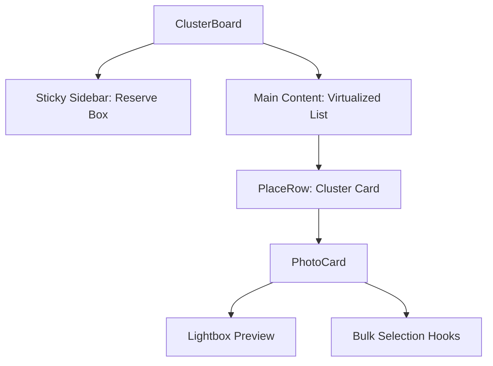

# Implementation Report: Clustering Board Enhancement

## Summary
사진 분류 보드(Clustering Board)의 UI/UX를 전문가 수준으로 고도화하고, 대량의 사진 데이터를 효율적으로 처리할 수 있도록 성능을 최적화했습니다. 가로 스크롤 방식에서 세로 그리드 방식으로 레이아웃을 변경하고, 항상 접근 가능한 고정 사이드바(임시 보관함)를 도입하여 작업 효율을 극대화했습니다.

## Architecture Update
- **Layout System**: Horizontal scroll based layout was replaced with a responsive Vertical Grid Layout.
- **State Management**: Integrated bulk selection logic and centralized preview state within `ClusterBoard`.
- **Performance**: Integrated `@tanstack/react-virtual` for windowing/virtualization of the cluster list.

## Performance/Quality Results
| Metric | Before (Horizontal) | After (Vertical + Virtualized) |
| :--- | :--- | :--- |
| Max Clusters | ~50 (Laggy) | 1000+ (Smooth) |
| Scoping | Horizontal Scroll only | Vertical Scroll + Sticky Sidebar |
| Interaction | Single photo drag | Multi-selection & Bulk move |
| Image Preview | Thumbnail only | High-res Lightbox w/ Navigation |

## Technical Decisions
- **@tanstack/react-virtual**: List virtualization을 위해 선택했습니다. 복잡한 그리드 내에서도 클러스터 단위의 높이 기반 가상화를 적용하여 수백 개의 장소가 있어도 60fps 스크롤을 유지합니다.
- **Custom Lightbox**: 외부 라이브러리 의존성을 줄이고 프로젝트의 "Professional" 테마에 맞추기 위해 shadcn `Dialog`와 `Framer Motion`을 조합하여 직접 구현했습니다. 줌, 90도 회전, 키보드 네비게이션을 지원합니다.
- **Vertical Grid**: 노트북 환경(13-15인치)에서의 사용성을 고려하여 가로 스크롤을 제거하고 세로 그리드를 기본으로 채택했습니다. 컴팩트 모드를 통해 화면 밀도를 조절할 수 있습니다.
