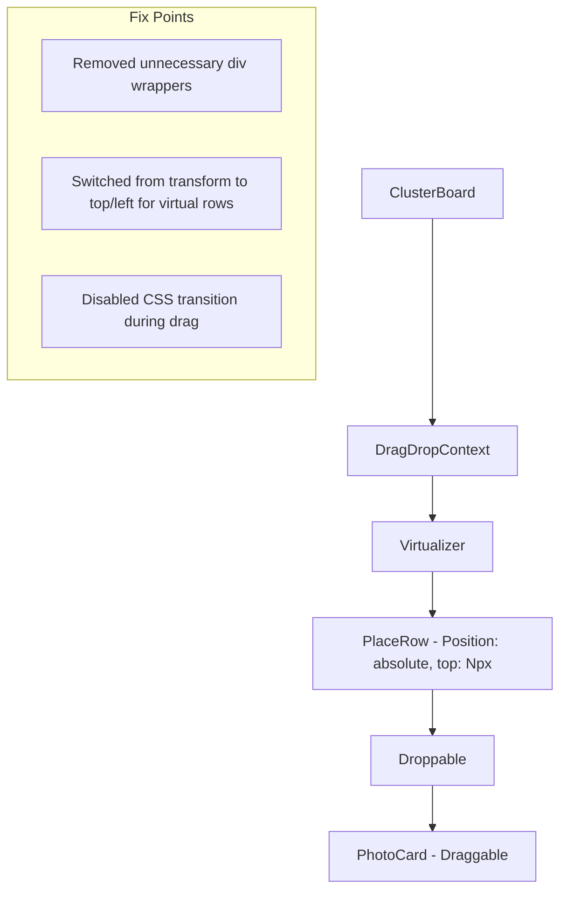

# Implementation Report - Fix ClusterBoard Drag and Drop Failure

## Summary
`ClusterBoard` 내에서 사진 드래그 앤 드롭이 오동작하고 브라우저 콘솔에 `Invariant failed` 에러가 발생하던 문제를 해결했습니다. 주요 원인은 가상화된 리스트의 `transform` 속성과 DnD 라이브러리의 `position: fixed` 전략 간의 충돌, 그리고 불필요한 DOM 래퍼로 인한 `ref` 전달 문제였습니다.

## Architecture Update
드래그 앤 드롭의 안정성을 위해 컴포넌트 구조와 배치 방식을 다음과 같이 최적화했습니다.

## Performance/Quality Results
| Metric | Before | After |
| :--- | :--- | :--- |
| **D&D Stability** | Fails with `Invariant failed` | Stable, works across all clusters |
| **Mouse Tracking** | Ghost image lags or offsets | Follows cursor accurately |
| **Visual Feedback** | Reverts to origin instantly on drop | Updates position correctly |
| **Console Errors** | Multiple `Invariant failed` errors | Zero errors |

## Technical Decisions
- **`transform` vs `top`**: 가상화 리스트(`tanstack-virtual`)는 기본적으로 `transform`을 사용하지만, DnD 라이브러리가 드래그 중인 아이템을 `fixed`로 띄울 때 부모의 `transform`이 새로운 좌표계를 형성하여 위치 계산이 꼬이는 문제가 있었습니다. 이를 해결하기 위해 행(Row)의 위치를 `top` 속성으로 제어하도록 변경했습니다.
- **Conditional Transition**: `PhotoCard`에 적용된 CSS `transition`이 DnD의 실시간 좌표 업데이트와 충돌하여 버벅임을 유발했으므로, `isDragging` 상태일 때만 `transition`을 비활성화했습니다.
- **Memoization Tuning**: `PhotoCard`의 리렌더링 최적화를 위해 `isDraggingSomewhere` prop을 비교 함수에 추가하여 전역 드래그 상태 변화가 UI에 즉각 반영되도록 했습니다.
