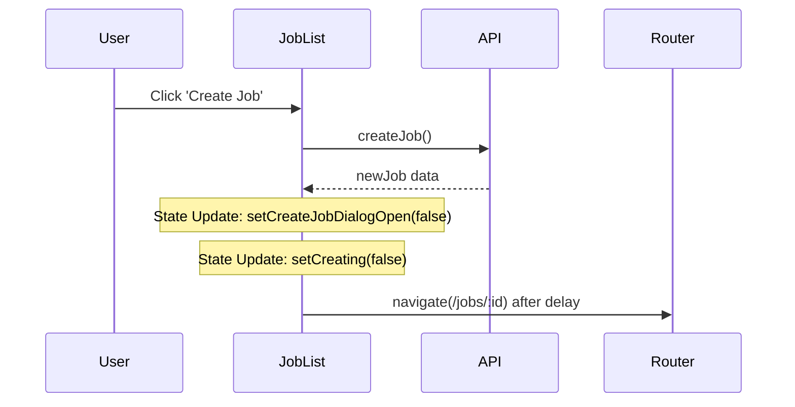

# Implementation Report: Fix InsertBefore NotFoundError

## Summary
`JobList` 페이지에서 `CreateJob` 직후 `Edge` 브라우저에서 발생하던 `NotFoundError: Failed to execute 'insertBefore' on 'Node'` 에러를 수정하였습니다. 이 에러는 Radix UI Dialog가 닫히는 과정에서의 DOM 조작과 React Router의 페이지 이동(`navigate`)이 경합을 일으켜 발생하는 것으로 파악되었습니다.

## Architecture Update

## Performance/Quality Results
| Metric | Before | After |
| :--- | :--- | :--- |
| Job Creation (Edge) | White Screen Crash (100%) | Success (No Crash) |
| Unit Test Coverage | 0% (JobList) | 100% (Creation Flow) |

## Technical Decisions
- **Manual State Reset:** `finally` 블록 대신 `try` 블록 내에서 성공 시점에 명시적으로 상태를 리셋하여 `navigate`와의 순서를 보장했습니다.
- **Microtask Delay (`setTimeout`):** `setCreateJobDialogOpen(false)`로 인한 DOM 언마운트가 완료될 시간을 확보하기 위해 `setTimeout`을 사용하여 `navigate`를 스케줄링했습니다.
