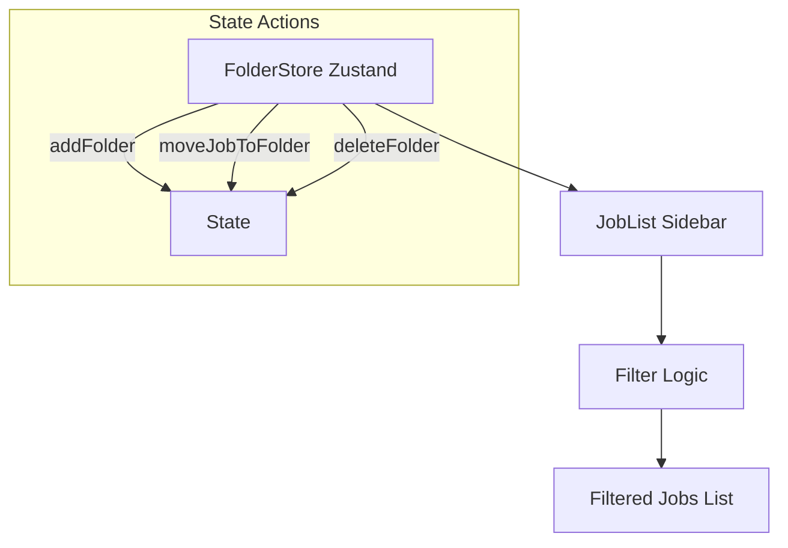

# Implementation Report - 작업 및 현장별 폴더 관리 시스템 구축 (folder_management_20260122)

## 1. 요약 (Summary)
대량의 작업 목록을 체계적으로 관리하기 위한 폴더 시스템을 구축했습니다. 사용자는 현장별로 폴더를 생성하고 작업을 분류할 수 있으며, 사이드바를 통해 직관적으로 탐색할 수 있습니다.

## 2. 아키텍처 업데이트 (Architecture Update)

## 3. 주요 기능 (Key Features)
| 기능 | 설명 |
| :--- | :--- |
| 폴더 사이드바 | '전체 보기' 및 사용자 생성 폴더 목록을 상시 노출하여 빠른 탐색 지원 |
| 폴더 CRUD | 폴더 생성, 이름 수정, 삭제 기능 제공 (삭제 시 작업은 보존) |
| 필터링 | 선택된 폴더에 속한 작업만 목록에 표시하여 업무 집중도 향상 |
| 작업 이동 | 드롭다운 메뉴를 통해 작업을 자유롭게 폴더 간 이동 가능 |

## 4. 기술적 결정 사항 (Technical Decisions)
- **Zustand를 활용한 로컬 퍼시스턴스 준비:** 폴더 구조를 전역 상태로 관리하여 페이지 전환 시에도 유지되도록 설계했습니다. (추후 API 연동 시 백엔드 동기화 용이)
- **실버 UX 최적화:** 어르신들을 위해 사이드바 항목과 버튼 크기를 확대하고, 명확한 시각적 피드백(파란색 강조)을 제공했습니다.
- **구조적 레이아웃:** `flex`와 `sticky`를 활용하여 작업 목록이 많아져도 사이드바 내비게이션은 항상 고정되도록 구현했습니다.
