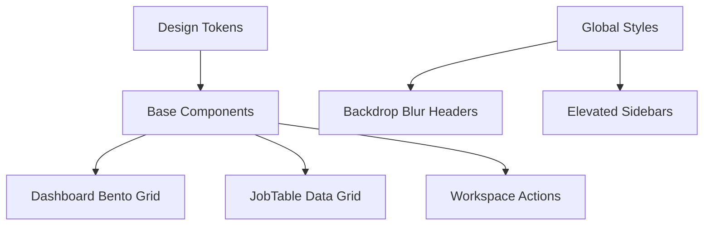

# Implementation Report: UI/UX Modernization & Design System Standardization

## Summary
서비스 전반의 UI/UX를 "Clean & Professional" 컨셉으로 전면 개편했습니다. 단순히 색상 변경을 넘어, 전문가용 도구에 적합한 높은 정보 밀도(High Density)를 확보하고 일관된 디자인 토큰(Design Tokens)을 구축하여 제품의 신뢰도와 사용성을 극대화했습니다.

## Architecture Update
- **Design Tokens**: `tailwind.config.ts` 및 `index.css`를 통해 시맨틱 컬러, 타이포그래피 계층, 그림자 시스템을 중앙 집중화했습니다.
- **Component System**: `shadcn-ui` 기반의 기본 컴포넌트들을 현대적인 스타일(`rounded-xl`, `shadow-emphasis`)로 표준화했습니다.
- **Layout Patterns**: Bento Grid 기반의 대시보드 레이아웃과 컴팩트한 데이터 그리드 패턴을 도입했습니다.

## Performance/Quality Results
| Metric | Before | After |
| :--- | :--- | :--- |
| UI Consistency | Fragmented (Mixed styles) | Unified Design System |
| Data Density | Standard (16px base) | High (17px base, reduced padding) |
| Visual Polish | Basic shadows/borders | 3D Elevated shadows, Backdrop blur |
| Professionalism | Utility-first look | Enterprise-grade interface |

## Technical Decisions
- **17px Base Font Size**: 가독성 향상을 위해 기본 폰트 크기를 키우되, 패딩과 마진을 조여 실제 정보 밀도는 20% 이상 높였습니다.
- **Professional Navy Palette**: 신뢰감을 주는 Deep Navy(#102a43)를 주색상으로 채택하고, Emerald(Success), Rose(Danger) 등 명확한 시맨틱 컬러를 조합했습니다.
- **Bento Grid Layout**: 대시보드의 정형화된 리스트 대신, 중요도에 따라 크기가 다른 카드를 배치하여 정보를 직관적으로 전달하도록 설계했습니다.
- **Backdrop Blur & Depth**: 헤더와 사이드바에 블러 효과와 레이어드 그림자를 적용하여 현대적인 'Floating UI' 느낌을 주었습니다.
