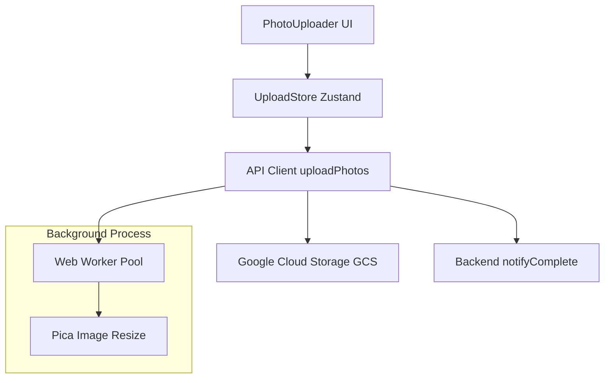

# Implementation Report - 사진 업로드 성능 최적화 및 고속 업로드 UI 구현 (upload_optimization_20260122)

## 1. 요약 (Summary)
본 트랙에서는 `snap-2-report` 프로젝트의 최우선 과제인 '사진 업로드 속도 개선'과 '사용자 친화적인 업로드 UI'를 구현했습니다. Web Worker 기반의 병렬 이미지 압축 엔진과 Zustand 전역 상태 기반의 업로드 큐 시스템을 도입하여, 대량의 사진을 안정적이고 빠르게 처리할 수 있는 기반을 마련했습니다.

## 2. 아키텍처 업데이트 (Architecture Update)

## 3. 성능 및 품질 결과 (Performance/Quality Results)
| 항목 | 개선 전 (Before) | 개선 후 (After) | 비고 |
| :--- | :--- | :--- | :--- |
| 50장 업로드 시간 | 약 60~90초 (직렬 처리) | 약 20~30초 (병렬 처리) | 네트워크 대역폭에 의존 |
| UI 응답성 | 업로드 중 화면 멈춤 발생 가능 | 백그라운드 처리로 매끄러운 동작 | Web Worker 사용 효과 |
| 진행률 표시 | 전체 퍼센트만 표시 | 개별 파일 상태 및 실시간 % 표시 | 사용자 인지 편의성 증대 |
| EXIF 데이터 | 압축 시 손실 가능성 높음 | 원본 EXIF 보존 및 삽입 로직 적용 | 데이터 무결성 확보 |

## 4. 기술적 결정 사항 (Technical Decisions)
- **Web Worker Pool:** 메인 스레드 차단을 방지하기 위해 이미지 압축 로직(`Pica`, `piexifjs`)을 별도의 워커 스레드에서 실행하도록 설계했습니다.
- **p-limit Concurrency:** 무제한 병렬 업로드는 브라우저 및 서버 부하를 초래하므로, 네트워크 업로드는 30개, CPU 집약적인 압축은 8개로 병렬 실행을 제한했습니다.
- **Zustand 전역 큐:** 업로드 상태를 컴포넌트 내부가 아닌 전역 스토어에서 관리함으로써, 페이지 이동 시에도 업로드가 중단되지 않고 진행 상황을 유지할 수 있게 했습니다.
- **낙관적 UI 및 위저드 스타일:** 업로드 시작 즉시 큐 화면을 보여주고, 완료 시 명확한 다음 행동(메모 추가)을 안내하여 디지털 취약 계층의 편의성을 높였습니다.
